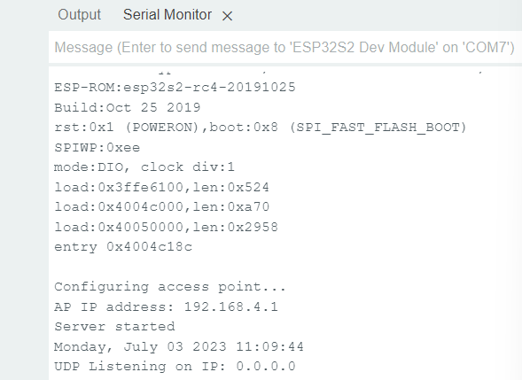
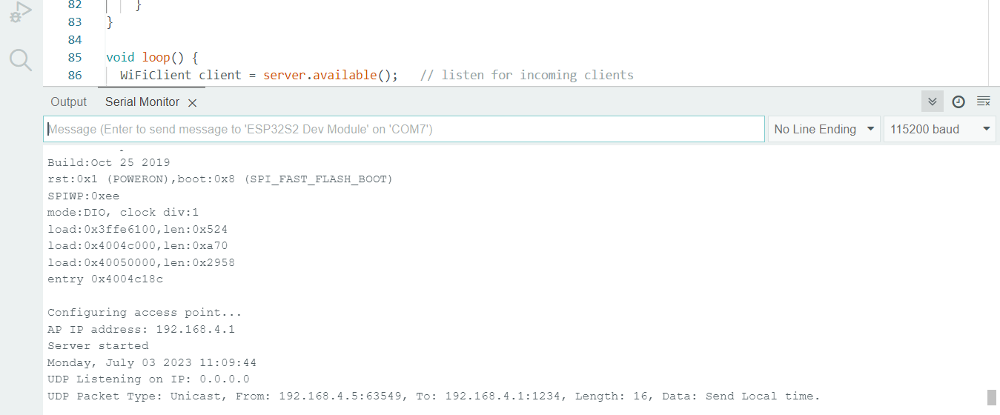
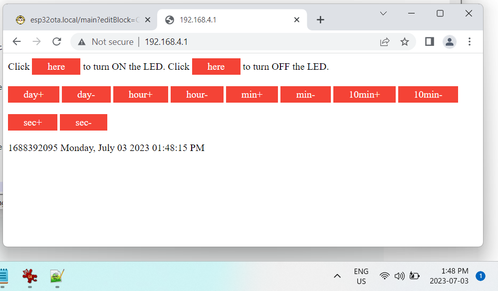

# ESP32 WiFi Access Point Webserver and UDP Timestamp

This sketch is intended to fill the gap for times and places were the internet is not available for NTP by providing
a local WiFi access point. It also provides a UDP server and webserver.

* The UDP server responds to UDP packets by returning a UDP packet containing local time data.
* The webserver landing page provides buttons to adjust the RTC on the Access Point ESP32. 

The expectation is that you will be using one ESP32 as this access point and one or more others that require local time when the power on. The client
ESP32s will wend a UDP packet to this server which responds with a UDP packet with local time data.

The only authentication required is the SSID pass phrase which needs to be at least 8 characters long. 

## Required Libraries

* [ESP32Time](https://github.com/fbiego/ESP32Time/tree/main)

The others are installed as part of the ESP32 core libraries.

## Combination of Modified Example Code

This code is a combination of modified example code.

## How to Use this Sketch

### Credential Setup

This is the access point you will set your computer or phone to use.

~~~~C++
// Set these to your desired credentials.
const char *ssid = "yourAP";               // *modify* set to something you will recognize
const char *password = "yourPassPhrase";   // must be 8 or more characters
~~~~

### Compile and Upload

Once the sketch is compiled and uploaded the monitor screen will look something like this:

When a UDP client powers up the serial monitor will show something like the following:

### Attach to Access Point

Follow procedure required by your computer or smartphone to use the SSID set at the beginning.

Point your web-browser to 192.168.4.1/  and you should see the following:

 
 
 
 At this point it is straight forward to adjust the clock. Will likely add some more adjustment buttons for month and year.
 
 ### Example Client
 
 Soon to add example client.
 
 